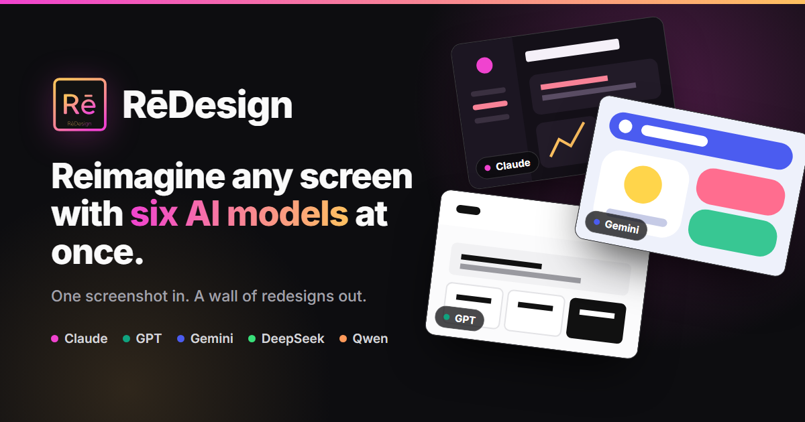
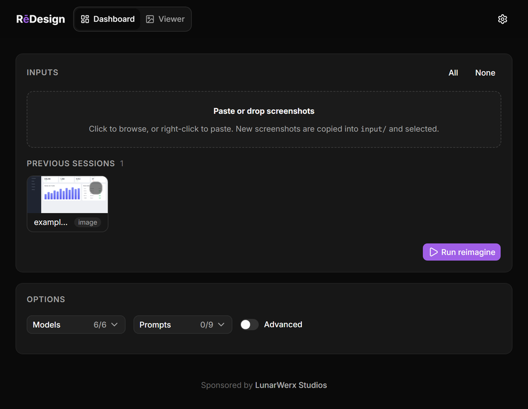
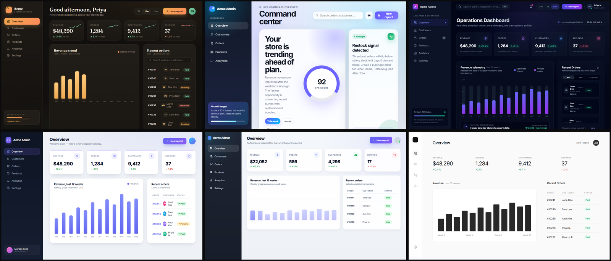

[](https://redes1gn.github.io/)

# RēDesign

**One screenshot in. A wall of AI redesigns out.**

[](https://github.com/LunarWerxs/ReDesign/actions/workflows/ci.yml)
[](https://bun.sh)
[](https://redes1gn.github.io/)

Feed it a screenshot of any screen. It fires that screenshot at a bunch of AI models at once and hands back a grid of real, self-contained HTML redesigns, each one sitting next to the original so you can actually judge it. No more pasting the same image into ten chat tabs and eyeballing the results one at a time.

It runs on your own machine and talks only to the model APIs you hand it keys for. There is one opt-in exception, off by default: a "Sync with Connections" toggle that signs you into LunarWerx's Connections account (`accounts.connections.icu`) to carry your theme across devices. Your API keys and other settings never leave your machine either way.

## What it looks like

Drop a screenshot into the control panel, pick the models and presets you want, and hit Run:



Here are six of the redesigns a single run produced from one sample dashboard, courtesy of Claude, GPT, Gemini and Qwen:



## Try it

You need [Bun](https://bun.sh) 1.2 or newer.

```sh
bun install
npm run build          # build the web UI (first run only)
cp .env.example .env   # drop in your API keys
bun run src/index.ts serve
```

Open http://127.0.0.1:5178, drop in a screenshot, tick a few models, hit Run. On Windows you can skip all that and just double-click `start.cmd`.

## Why it is nice

- **Every model at once.** Claude, GPT, Gemini, DeepSeek, and Qwen out of the box, plus any OpenAI-compatible endpoint you add. Star the handful you reach for so they sit up top, and leave the rest one click away in an "all models" drawer, the way VS Code Copilot does it. They all run in parallel, not one after another.
- **Many takes per model, one run.** Ask a single model for three variants and another for one, all in the same fan-out. A bake-off is more useful when you can see a model's range, not just one roll of the dice.
- **A stack of prompt presets.** Faithful refresh, bold reimagine, minimalist, conversion, and more. Or write your own.
- **A viewer worth using.** Filter by model or preset, set the column count, preview at phone through desktop widths. The original always sits first so you have something to compare against.
- **Paste your keys, skip the setup.** Drop in one key or a whole pile at once. It works out which service each belongs to, checking live when a key could belong to more than one, and files them in the right pool. Give each provider a stack of keys and it cycles through them, quietly benching the ones that start failing, then bringing them back later.
- **Safe by design.** The HTML each model writes runs in a locked-down iframe. You can click around in it, but it cannot touch your data.
- **It knows what it costs.** A per-run cost meter, plus an estimate before you hit Run, so a big fan-out never surprises you.
- **Scriptable.** Everything in the UI has a command-line twin, and there is an MCP server so an AI agent can drive it too.

## A little deeper

- **All config, no code.** Models live in `src/config/models.json`, prompts in `src/config/prompts.json`. Add one, disable one, or point it at a newer model version without touching the app.
- **Reference images.** Drop in a look you like and every model borrows its mood and colors, not its layout.
- **Text-only models still see the screen.** A model that cannot take images gets an auto-written description of your screenshot first, so it redesigns the real thing instead of guessing.
- **The stack.** Bun and Hono on the back end (one runtime dependency), a Vue 3 + Vite + Tailwind + shadcn-vue app on the front. Your keys never hit disk in the clear.

## From the command line

```sh
bun run src/index.ts run      # queue a run (add --mock for a free dry run)
bun run src/index.ts models   # models and how many keys each has
bun run src/index.ts keys     # key health
bun run src/index.ts mcp      # start the MCP server for agents
```

## Tests

```sh
bun test tests
```

Fully offline. No keys, no spend.

## License

MIT. Do what you want with it. See [LICENSE](LICENSE).

Made by LunarWerx. Live site: [redes1gn.github.io](https://redes1gn.github.io/).
