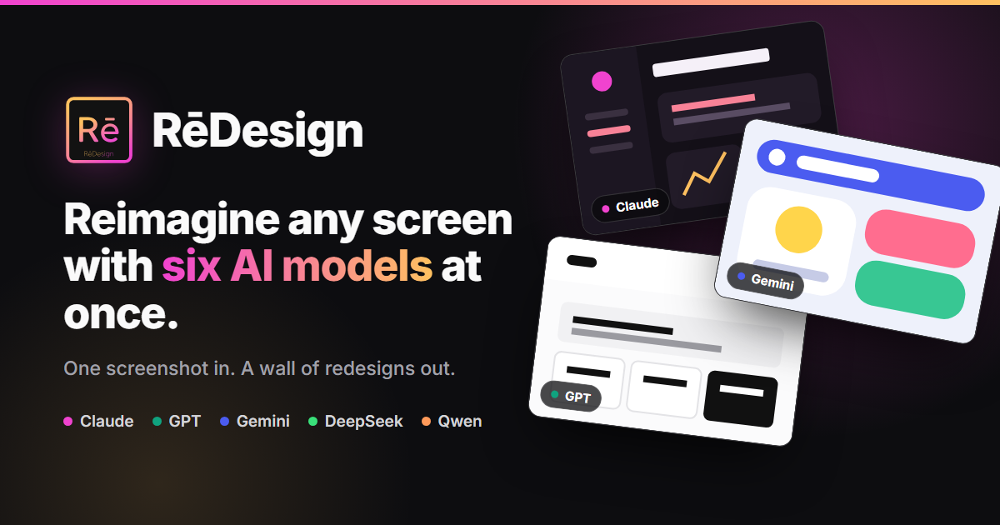
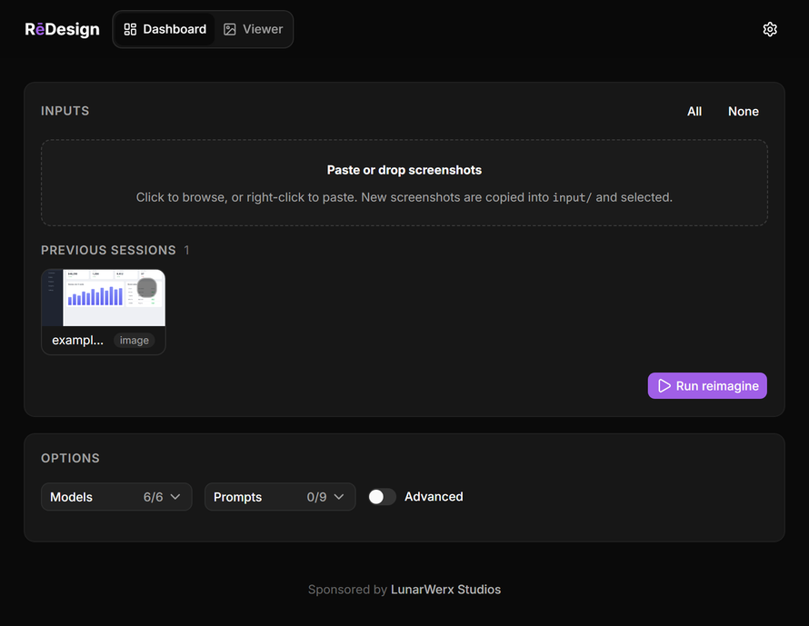
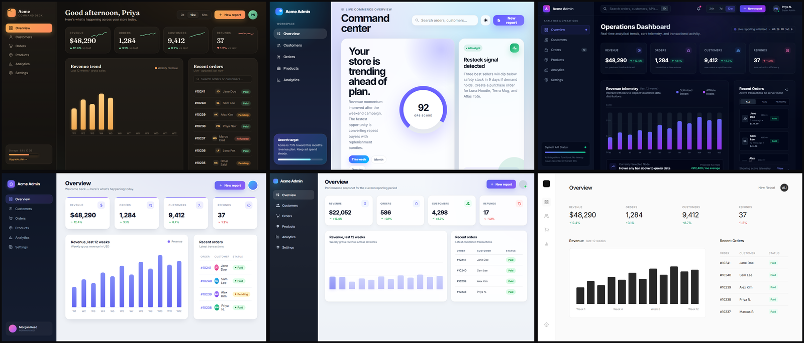

[](https://redes1gn.github.io/)

# RēDesign

**One screenshot in. A wall of AI redesigns out.**

[](https://github.com/LunarWerxs/ReDesign/actions/workflows/ci.yml)
[](https://bun.sh)
[](https://redes1gn.github.io/)

Feed it a screenshot of any screen. It fires that screenshot at a bunch of AI models at once and hands back a grid of real, self-contained HTML redesigns, each one sitting next to the original so you can actually judge it. No more pasting the same image into ten chat tabs and eyeballing the results one at a time.

It runs on your own machine and talks only to the model APIs you give it keys for. An optional "Sync with Connections" toggle can carry your theme across devices; your API keys never leave your machine.

## What it looks like

Drop a screenshot into the control panel, pick the models and presets you want, and hit Run:



Here are six of the redesigns a single run produced from one sample dashboard, courtesy of Claude, GPT, Gemini and Qwen:



## Try it

On Windows, download `redesign-windows-x64.exe` from
[Releases](https://github.com/LunarWerxs/ReDesign/releases) and run it directly. It is an
icon-bearing GUI executable with the web app embedded and no console window. The plain ZIP beside it
is the smaller automatic-update transport.

Want a system-tray icon? Take `redesign-windows-x64-with-tray.zip` instead, run
`misc\Create-Shortcut.ps1` once, and launch from the shortcut it creates. The icon is drawn by a
small separate launcher (`misc\lunarwerx-tray.exe`), so running `redesign.exe` on its own never
produces one.

To run from source on any supported OS, you need [Bun](https://bun.sh) 1.2 or newer.

```sh
bun install
npm run build          # build the web UI (first run only)
cp .env.example .env   # drop in your API keys
bun run src/index.ts serve
```

Open http://127.0.0.1:5178, drop in a screenshot, tick a few models, hit Run. On Windows you can skip all that and just double-click `start.cmd`.

## Why it is nice

- **Every model at once.** Claude, GPT, Gemini, DeepSeek, and Qwen out of the box, plus any OpenAI-compatible endpoint you add. Star the handful you reach for so they sit up top, and leave the rest one click away in an "all models" drawer, the way VS Code Copilot does it. They all run in parallel, not one after another.
- **Many takes per model, one run.** Ask a single model for three variants and another for one, all in the same fan-out. A bake-off is more useful when you can see a model's range, not just one roll of the dice.
- **A stack of prompt presets.** Faithful refresh, bold reimagine, minimalist, conversion, and more. Or write your own.
- **A viewer worth using.** Start from an all-runs thumbnail gallery, search it, filter by model or preset, set the column count, and preview at phone through desktop widths. Stars and hidden-output choices survive a refresh, and the original always sits first so you have something to compare against. Take a whole run away as a zip when you want to review it offline.
- **One dead key doesn't cost you the batch.** If a model fails or gets skipped because its keys are cooling down, retry just those jobs rather than paying for the whole fan-out again. Any past run can also be reloaded into the control panel exactly as it was and run again.
- **A queue you control.** Park several batches before spending keys, start them together, add more work behind a live run, and drag waiting batches into the order you want.
- **Paste your keys, skip the setup.** Drop in one key or a whole pile at once. It works out which service each belongs to, checking live when a key could belong to more than one, and files them in the right pool. Give each provider a stack of keys and it cycles through them, quietly benching the ones that start failing, then bringing them back later.
- **Safe by design.** The HTML each model writes runs in a locked-down iframe. You can click around in it, but it cannot touch your data.
- **It knows what it costs.** A per-run cost meter, plus an estimate before you hit Run, so a big fan-out never surprises you.
- **It tells you when it's finished.** A fan-out runs for minutes, so if you have tabbed away it raises a desktop notification rather than a toast you will never see.
- **Scriptable.** Everything in the UI has a command-line twin, and there is an MCP server so an AI agent can drive it too.

## A little deeper

- **All config, no code.** Models and prompts live in `~/.redesign/config/` (set `REDESIGN_HOME` to move it), seeded on first run and shared by the packaged app and a from-source checkout alike. Add a model, disable one, or point it at a newer version without touching the app. The copies under `src/config/` are the shipped seeds, not your live settings.
- **Reference images.** Drop or paste in a look you like, choose exactly which references to send, and every model borrows their mood and colors rather than their layout.
- **Grounded by default.** Every run inventories the screenshot once with a vision model and hands that description to every model alongside the image, so redesigns keep the real content instead of quietly dropping a tab or inventing a metric. It measurably beat the ungrounded path on content fidelity, so it is simply how runs work now, with no switch to remember.
- **The stack.** Bun and Hono on the back end (one runtime dependency), a Vue 3 + Vite + Tailwind + shadcn-vue app on the front.
- **Where your keys live.** In `.env` beside the app, written owner-only (`0600`), and nowhere else. They are never sent anywhere but the provider you configured, never written into a run's saved output or its key-health state, and they are stripped out of any provider error text before it is stored or shown. If you use the optional Connections sync, its session token is additionally encrypted at rest with DPAPI on Windows; on macOS and Linux that token is stored as a plain `0600` file.

## From the command line

```sh
bun run src/index.ts run      # queue a run (add --mock for a free dry run)
                              # --model-quantities id=n,id=n  per-model output counts
                              # --brand-style-guide-file b.md  brand notes for every prompt
bun run src/index.ts models   # models and how many keys each has
bun run src/index.ts keys     # key health
bun run src/index.ts mcp      # start the MCP server for agents
```

## Privacy

RēDesign pings LunarWerx's Studio endpoint (the same one its update check already uses) so we
know roughly how many people run it. Each ping carries the app version, a coarse OS tag (e.g.
`win11`, `macos`, `linux`), and a random install id generated once and stored locally. From that
request, the server also derives and stores a coarse location (country, region, city, timezone),
your network's ASN, locale, and a truncated user agent, but never an IP address. It never sends
your account, your files, your screenshots, your API keys, or anything else about you or your
machine. Set `REDESIGN_NO_PING=1` to turn it off entirely.

## Tests

```sh
bun test tests
bun run check:spawntimeout   # repo guardrail, also a CI step
```

Fully offline. No keys, no spend.

`check:spawntimeout` fails a test, or a lifecycle hook, that reaches a subprocess while inheriting
bun's 5s default. State one: `test(name, fn, 20_000)`, or `beforeAll(fn, 20_000)` for a hook, where
the timeout is the second argument. Such a case times the machine rather than its own assertions,
and a cold Windows CI runner runs that class roughly 10x slower than a dev box. The tray-launcher
suite is the local example: five cases at 0.33-0.41s each here, one of which crossed 5s on
windows-latest and held the whole daemon job red until it was given an allowance.

## License

MIT. Do what you want with it. See [LICENSE](LICENSE).

Made by LunarWerx. Live site: [redes1gn.github.io](https://redes1gn.github.io/).
